# FinanceRAG - Comprehensive Documentation

## 📋 Table of Contents
- [Overview](#overview)
- [Architecture](#architecture)
- [Features](#features)
- [Technology Stack](#technology-stack)
- [Installation & Setup](#installation--setup)
- [Configuration](#configuration)
- [Usage](#usage)
- [API Reference](#api-reference)
- [Agent Details](#agent-details)
- [Project Structure](#project-structure)
- [Development](#development)
- [Troubleshooting](#troubleshooting)

---

## 🎯 Overview

**FinanceRAG** is a production-grade, multi-agent, autonomous, self-learning, web-scraping Retrieval-Augmented Generation (RAG) system specifically designed for financial intelligence. It combines the power of Large Language Models (LLMs) with real-time web data to provide accurate, up-to-date financial information with a focus on the Indian financial context.

### Key Highlights
- **Domain-Specific**: Exclusively focused on finance-related queries
- **India-First**: Defaults to Indian financial context (RBI, SEBI, IRDAI, GST, etc.)
- **Real-Time Data**: Automatically searches and scrapes latest financial information
- **Multi-Agent Architecture**: 8 specialized agents working in orchestrated pipeline
- **Open-Source Stack**: Built entirely with open-source technologies
- **Production-Ready**: Includes FastAPI backend and Streamlit UI

---

## 🏗️ Architecture

FinanceRAG follows a **multi-agent pipeline architecture** where each agent has a specific responsibility:

```mermaid
graph LR
    A[User Query] --> B[Web Search Agent]
    B --> C[Web Scraper Agent]
    C --> D[Preprocessing Agent]
    D --> E[Indexing Agent]
    E --> F[Retrieval Agent]
    F --> G[Reranker Agent]
    G --> H[Answering Agent]
    H --> I[Evaluation Agent]
    I --> J[Response with Sources]
```



### Pipeline Flow
1. **Web Search** → Finds relevant URLs using DuckDuckGo
2. **Web Scraping** → Extracts content from discovered URLs
3. **Preprocessing** → Chunks text into manageable pieces
4. **Indexing** → Embeds and stores chunks in vector database
5. **Retrieval** → Fetches relevant chunks for the query
6. **Reranking** → Refines results using cross-encoder
7. **Answering** → Generates structured response using LLM
8. **Evaluation** → Assesses answer quality

---

## ✨ Features

### 🤖 Multi-Agent System
- **8 Specialized Agents**: Each optimized for specific tasks
- **Autonomous Operation**: Agents work independently and collaboratively
- **Error Handling**: Graceful degradation when agents fail

### 🌐 Web Intelligence
- **Real-Time Search**: DuckDuckGo integration for latest information
- **Smart Scraping**: BeautifulSoup-based content extraction
- **Content Cleaning**: Removes scripts, styles, navigation elements
- **Metadata Preservation**: Tracks sources and titles

### 📚 Advanced RAG
- **Hybrid Retrieval**: Vector search with ChromaDB
- **Semantic Embeddings**: HuggingFace sentence-transformers
- **Cross-Encoder Reranking**: Improves relevance with `ms-marco-MiniLM-L-6-v2`
- **Configurable Chunk Size**: 800 characters with 100 character overlap

### 🇮🇳 India-Focused Intelligence
- **Default Geography**: All answers default to Indian financial context
- **Regulatory Awareness**: RBI, SEBI, IRDAI, MoF, GST, ITR coverage
- **Latest News Integration**: Includes recent financial news in responses
- **Domain Restriction**: Only answers finance-related queries

### 🎨 Structured Responses
Every answer follows a mandatory format:
- **A. Summary**: 2-4 bullet points
- **B. Detailed Explanation**: Concepts, regulations, examples
- **C. Insights from Latest News**: Recent updates
- **D. Final Verdict/TL;DR**: 1-2 line conclusion

### 🔍 Quality Assurance
- **Automatic Evaluation**: Heuristic-based answer assessment
- **Citation Tracking**: Source attribution
- **Relevance Scoring**: Keyword overlap analysis
- **No Hallucinations**: RAG-grounded responses only

### 🚀 Dual Interface
- **FastAPI Backend**: RESTful API with `/ask` and `/health` endpoints
- **Streamlit UI**: Interactive web interface with real-time feedback
- **Source Display**: Shows all retrieved sources with metadata

### ⚙️ Flexible LLM Support
- **Google Gemini**: Default provider (gemini-flash-latest)
- **Ollama**: Local LLM support (llama3)
- **Easy Switching**: Environment variable configuration

---

## 🛠️ Technology Stack

### Core Technologies
| Component | Technology | Purpose |
|-----------|-----------|---------|
| **LLM** | Google Gemini / Ollama | Answer generation |
| **Embeddings** | HuggingFace Transformers | Semantic search |
| **Vector Store** | ChromaDB | Document storage & retrieval |
| **Search Engine** | DuckDuckGo | Web search |
| **Web Scraping** | BeautifulSoup4 | Content extraction |
| **Reranker** | Cross-Encoder | Result refinement |
| **Backend** | FastAPI | REST API |
| **Frontend** | Streamlit | User interface |

### Python Libraries
```
langchain                    # LLM orchestration
langchain-community          # Community integrations
langchain-huggingface        # HuggingFace embeddings
langchain-chroma             # ChromaDB integration
langchain-google-genai       # Google Gemini integration
chromadb                     # Vector database
sentence-transformers        # Embedding models
duckduckgo-search           # Web search
beautifulsoup4              # HTML parsing
requests                    # HTTP client
fastapi                     # Web framework
uvicorn                     # ASGI server
streamlit                   # UI framework
python-dotenv               # Environment management
```

---

## 📦 Installation & Setup

### Prerequisites
- Python 3.8+
- pip package manager
- (Optional) Ollama for local LLM

### Step 1: Clone Repository
```bash
git clone <repository-url>
cd FinanceRAG
```

### Step 2: Create Virtual Environment
```bash
python -m venv venv

# Windows
venv\Scripts\activate

# Linux/Mac
source venv/bin/activate
```

### Step 3: Install Dependencies
```bash
pip install -r requirements.txt
```

### Step 4: Install Playwright (for advanced scraping)
```bash
playwright install
```

### Step 5: Setup Ollama (Optional - for local LLM)
```bash
# Download and install Ollama from https://ollama.ai

# Start Ollama server
ollama serve

# Pull model
ollama pull llama3
```

### Step 6: Configure Environment
Create a `.env` file in the project root:

```env
# LLM Configuration
LLM_PROVIDER=gemini                    # or "ollama"
LLM_MODEL=gemini-flash-latest          # or "llama3"
GOOGLE_API_KEY=your_api_key_here       # Required for Gemini

# Database Configuration
CHROMA_DB_DIR=./chroma_db
COLLECTION_NAME=finance_rag

# Ollama Configuration (if using Ollama)
OLLAMA_BASE_URL=http://localhost:11434

# Embedding Configuration
EMBEDDING_MODEL_NAME=sentence-transformers/all-MiniLM-L6-v2

# Search Configuration
SEARCH_RESULTS_LIMIT=20

# Reranker Configuration
RERANKER_MODEL_NAME=cross-encoder/ms-marco-MiniLM-L-6-v2
```

---

## ⚙️ Configuration

### Environment Variables

| Variable | Default | Description |
|----------|---------|-------------|
| `LLM_PROVIDER` | `gemini` | LLM provider: `gemini` or `ollama` |
| `LLM_MODEL` | `gemini-flash-latest` | Model name |
| `GOOGLE_API_KEY` | - | Google API key (required for Gemini) |
| `CHROMA_DB_DIR` | `./chroma_db` | ChromaDB storage directory |
| `COLLECTION_NAME` | `finance_rag` | ChromaDB collection name |
| `OLLAMA_BASE_URL` | `http://localhost:11434` | Ollama server URL |
| `EMBEDDING_MODEL_NAME` | `sentence-transformers/all-MiniLM-L6-v2` | Embedding model |
| `SEARCH_RESULTS_LIMIT` | `20` | Max search results to fetch |
| `RERANKER_MODEL_NAME` | `cross-encoder/ms-marco-MiniLM-L-6-v2` | Reranker model |

### Customizing Agents

#### Text Chunking (Preprocessing Agent)
Edit `agents/preprocessing.py`:
```python
self.text_splitter = RecursiveCharacterTextSplitter(
    chunk_size=800,        # Adjust chunk size
    chunk_overlap=100,     # Adjust overlap
)
```

#### Retrieval Count
Edit `agents/retrieval.py`:
```python
self.retriever = db_service.get_retriever(k=40)  # Adjust k value
```

#### Reranking Top-K
Edit `agents/reranker.py`:
```python
def rerank(self, query: str, docs: list, top_k: int = 5):  # Adjust top_k
```

---

## 🚀 Usage

### Running the API Server

```bash
uvicorn api.main:app --reload
```

The API will be available at `http://localhost:8000`

**API Endpoints:**
- `POST /ask` - Submit a query
- `GET /health` - Health check

### Running the Streamlit UI

```bash
streamlit run ui/app.py
```

The UI will open in your browser at `http://localhost:8501`

### Using the Python Pipeline Directly

```python
from core.pipeline import pipeline

# Ask a question
result = pipeline.run("What is the current RBI repo rate?")

# Access results
print(result["answer"])
print(result["sources"])
print(result["evaluation"])
```

---

## 📡 API Reference

### POST /ask

Submit a financial query and receive an answer with sources.

**Request:**
```json
{
  "query": "What is the current RBI repo rate?"
}
```

**Response:**
```json
{
  "answer": "**A. Summary**\n- Current RBI repo rate is 6.50%\n...",
  "sources": [
    {
      "source": "https://rbi.org.in/...",
      "title": "RBI Monetary Policy"
    }
  ],
  "evaluation": {
    "score": 1.0,
    "feedback": []
  }
}
```

**Status Codes:**
- `200` - Success
- `500` - Internal server error

### GET /health

Check API health status.

**Response:**
```json
{
  "status": "healthy"
}
```

---

## 🤖 Agent Details

### 1. Web Search Agent
**File:** `agents/web_search.py`

**Purpose:** Searches the web for relevant financial information

**Features:**
- DuckDuckGo integration
- Configurable result limit
- Result normalization (title, link, snippet)
- Error handling with empty result fallback

**Key Method:**
```python
search_web(query: str) -> List[Dict]
```

---

### 2. Web Scraper Agent
**File:** `agents/web_scraper.py`

**Purpose:** Extracts clean text content from web pages

**Features:**
- BeautifulSoup4 HTML parsing
- Removes scripts, styles, navigation, headers, footers
- User-agent spoofing
- 10-second timeout
- Metadata extraction (title, source URL)

**Key Method:**
```python
scrape_url(url: str) -> Dict[str, Any]
```

**Returns:**
```python
{
    "text": "cleaned content",
    "metadata": {
        "source": "url",
        "title": "page title"
    }
}
```

---

### 3. Preprocessing Agent
**File:** `agents/preprocessing.py`

**Purpose:** Splits text into semantic chunks

**Features:**
- Recursive character text splitting
- 800 character chunks
- 100 character overlap
- Metadata preservation
- LangChain Document creation

**Key Method:**
```python
process_text(text: str, metadata: dict) -> List[Document]
```

**Configuration:**
- `chunk_size`: 800
- `chunk_overlap`: 100
- `length_function`: len

---

### 4. Embedding & Indexing Agent
**File:** `agents/indexing.py`

**Purpose:** Embeds documents and stores in vector database

**Features:**
- HuggingFace embeddings
- ChromaDB storage
- Batch indexing
- Automatic persistence

**Key Method:**
```python
index_documents(documents: List[Document]) -> None
```

**Embedding Model:** `sentence-transformers/all-MiniLM-L6-v2`

---

### 5. Retrieval Agent
**File:** `agents/retrieval.py`

**Purpose:** Retrieves relevant documents for a query

**Features:**
- Vector similarity search
- Configurable k value
- ChromaDB retriever
- Semantic matching

**Key Method:**
```python
retrieve(query: str) -> List[Document]
```

**Default Retrieval:** 40 documents (2x search limit for reranking)

---

### 6. Reranker Agent
**File:** `agents/reranker.py`

**Purpose:** Refines retrieval results using cross-encoder

**Features:**
- Cross-encoder scoring
- Query-document pair evaluation
- Score-based sorting
- Top-k selection
- Graceful fallback if model fails

**Key Method:**
```python
rerank(query: str, docs: list, top_k: int = 5) -> List[Document]
```

**Model:** `cross-encoder/ms-marco-MiniLM-L-6-v2`

---

### 7. Answering Agent
**File:** `agents/answering.py`

**Purpose:** Generates structured financial answers

**Features:**
- Domain restriction (finance-only)
- India-first context
- RAG-grounded responses
- Latest news integration
- Structured output format
- No hallucinations
- Citation support

**Key Method:**
```python
generate_answer(query: str, context_docs: list) -> str
```

**Answer Structure:**
```
A. Summary (2-4 bullet points)
B. Detailed Explanation
   - Concepts
   - Regulations
   - Examples (Indian context)
C. Insights from Latest News
D. Final Verdict / TL;DR
```

**Behavior:**
- Refuses non-finance queries
- Defaults to Indian financial context
- Cites retrieved documents
- Includes latest news
- Professional, concise, factual tone

---

### 8. Evaluation Agent
**File:** `agents/evaluation.py`

**Purpose:** Evaluates answer quality

**Features:**
- Heuristic scoring (0.0 - 1.0)
- Length check (minimum 50 characters)
- Citation detection
- Keyword overlap analysis
- Feedback generation

**Key Method:**
```python
evaluate(query: str, answer: str, context_docs: list) -> Dict
```

**Scoring Criteria:**
- Answer length: +0.3
- Citations present: +0.4
- Keyword overlap: +0.3

**Returns:**
```python
{
    "score": 0.7,
    "feedback": ["No citations found."]
}
```

---

## 📁 Project Structure

```
FinanceRAG/
├── agents/                      # Multi-agent system
│   ├── __init__.py
│   ├── web_search.py           # DuckDuckGo search
│   ├── web_scraper.py          # BeautifulSoup scraping
│   ├── preprocessing.py        # Text chunking
│   ├── indexing.py             # Vector indexing
│   ├── retrieval.py            # Document retrieval
│   ├── reranker.py             # Cross-encoder reranking
│   ├── answering.py            # LLM answer generation
│   └── evaluation.py           # Answer evaluation
│
├── api/                         # FastAPI backend
│   └── main.py                 # REST API endpoints
│
├── core/                        # Core services
│   ├── config.py               # Configuration management
│   ├── database.py             # ChromaDB service
│   ├── llm.py                  # LLM service (Gemini/Ollama)
│   └── pipeline.py             # Agent orchestration
│
├── ui/                          # Streamlit frontend
│   └── app.py                  # Web interface
│
├── chroma_db/                   # Vector database storage
│
├── .env                         # Environment variables
├── .gitignore                  # Git ignore rules
├── requirements.txt            # Python dependencies
├── README.md                   # Quick start guide
├── DOCUMENTATION.md            # This file
└── main.py                     # CLI entry point
```

---

## 🔧 Development

### Adding a New Agent

1. Create agent file in `agents/` directory
2. Implement agent class with required methods
3. Add logging
4. Create singleton instance
5. Import in `core/pipeline.py`
6. Add to pipeline flow

**Example:**
```python
# agents/my_agent.py
import logging

logger = logging.getLogger(__name__)

class MyAgent:
    def process(self, data):
        logger.info("Processing data")
        # Your logic here
        return result

my_agent = MyAgent()
```

### Extending the Pipeline

Edit `core/pipeline.py` to add new steps:

```python
def run(self, query: str):
    # ... existing steps ...
    
    # Add new step
    custom_result = my_agent.process(data)
    
    # ... continue pipeline ...
```

### Custom Prompts

Modify the prompt template in `agents/answering.py`:

```python
self.prompt_template = PromptTemplate(
    input_variables=["context", "question"],
    template="""Your custom prompt here..."""
)
```

### Testing Individual Agents

```python
# Test web search
from agents.web_search import web_search_agent
results = web_search_agent.search_web("RBI repo rate")
print(results)

# Test scraping
from agents.web_scraper import web_scraper_agent
data = web_scraper_agent.scrape_url("https://example.com")
print(data)

# Test retrieval
from agents.retrieval import retrieval_agent
docs = retrieval_agent.retrieve("What is GST?")
print(docs)
```

---

## 🐛 Troubleshooting

### Common Issues

#### 1. ChromaDB Connection Error
```
Error: Could not connect to ChromaDB
```

**Solution:**
- Ensure `chroma_db` directory exists
- Check write permissions
- Delete `chroma_db` folder and restart

#### 2. Ollama Connection Failed
```
Error: Connection refused to localhost:11434
```

**Solution:**
```bash
# Start Ollama server
ollama serve

# Verify it's running
curl http://localhost:11434
```

#### 3. Google API Key Error
```
Error: Invalid API key
```

**Solution:**
- Get API key from [Google AI Studio](https://makersuite.google.com/app/apikey)
- Add to `.env` file: `GOOGLE_API_KEY=your_key`
- Restart the application

#### 4. Import Errors
```
ModuleNotFoundError: No module named 'langchain'
```

**Solution:**
```bash
pip install -r requirements.txt
```

#### 5. Playwright Browser Not Found
```
Error: Playwright browser not installed
```

**Solution:**
```bash
playwright install
```

#### 6. Slow Performance

**Solutions:**
- Reduce `SEARCH_RESULTS_LIMIT` in `.env`
- Use smaller embedding model
- Reduce retrieval `k` value
- Use Gemini instead of Ollama (faster)

#### 7. No Search Results

**Possible Causes:**
- Network connectivity issues
- DuckDuckGo rate limiting
- Invalid query

**Solution:**
- Check internet connection
- Wait a few minutes and retry
- Simplify query

#### 8. Empty Answers

**Possible Causes:**
- No relevant documents retrieved
- LLM connection failed
- Scraping blocked

**Solution:**
- Check logs for errors
- Verify LLM is running
- Try different query

---

## 📊 Performance Metrics

### Typical Response Times
- Web Search: 2-5 seconds
- Scraping (per URL): 1-3 seconds
- Embedding & Indexing: 0.5-2 seconds
- Retrieval: 0.1-0.5 seconds
- Reranking: 0.2-1 second
- Answer Generation: 3-10 seconds

**Total Pipeline:** ~10-30 seconds (depending on number of URLs)

### Resource Usage
- **Memory:** ~2-4 GB (with models loaded)
- **Disk:** ~500 MB (models + database)
- **CPU:** Moderate (embedding/reranking intensive)

---

## 🔐 Security Considerations

1. **API Keys:** Never commit `.env` file to version control
2. **Rate Limiting:** Implement rate limiting for production
3. **Input Validation:** Sanitize user queries
4. **CORS:** Configure CORS for production deployment
5. **HTTPS:** Use HTTPS in production
6. **Authentication:** Add authentication for API endpoints

---

## 🚀 Production Deployment

### Docker Deployment (Recommended)

Create `Dockerfile`:
```dockerfile
FROM python:3.10-slim

WORKDIR /app

COPY requirements.txt .
RUN pip install --no-cache-dir -r requirements.txt
RUN playwright install --with-deps chromium

COPY . .

EXPOSE 8000

CMD ["uvicorn", "api.main:app", "--host", "0.0.0.0", "--port", "8000"]
```

Build and run:
```bash
docker build -t financerag .
docker run -p 8000:8000 --env-file .env financerag
```

### Environment Variables for Production
```env
LLM_PROVIDER=gemini
GOOGLE_API_KEY=production_key
CHROMA_DB_DIR=/data/chroma_db
LOG_LEVEL=INFO
```

---

## 📝 License

This project is open-source. Please check the repository for license details.

---

## 🤝 Contributing

Contributions are welcome! Please:
1. Fork the repository
2. Create a feature branch
3. Make your changes
4. Add tests
5. Submit a pull request

---

## 📧 Support

For issues and questions:
- Open an issue on GitHub
- Check existing documentation
- Review troubleshooting section

---

## 🎓 Credits

Built with:
- LangChain
- ChromaDB
- HuggingFace Transformers
- Google Gemini
- Ollama
- FastAPI
- Streamlit

---

**Last Updated:** November 2025
**Version:** 1.0.0
